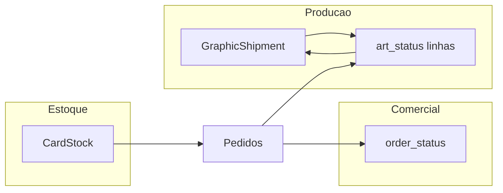

# Total no resumo da gráfica + visão de processo

## 1. Alteração de código (mensagem com total)

**Onde:** [`backend/src/modules/stock/services/get-graphic-summary.service.ts`](backend/src/modules/stock/services/get-graphic-summary.service.ts), função `formatGraphicSummaryClipboardText`.

**Comportamento:**
- Quando `lines.length > 0`, calcular `total = lines.reduce((sum, line) => sum + line.quantity, 0)` e acrescentar ao final do texto, após o corpo com bullets, algo como duas linhas em branco opcional + **`Total de unidades: N`** (PT-BR, claro para a gráfica).
- Quando `lines.length === 0`, opcional mas consistente: acrescentar **`Total de unidades: 0`** no final (ou manter só o parágrafo explicativo atual — prefira incluir o total 0 para formato previsível).

**Opcional API:** incluir `total_units: z.number().int()` em [`graphic-summary.schema.ts`](backend/src/modules/stock/schemas/graphic-summary.schema.ts) preenchido no service (útil se no futuro a UI quiser exibir o total sem parsear o texto). Não é obrigatório se você quiser manter o diff mínimo só no `clipboard_text`.

**Frontend:** nenhuma mudança obrigatória — o botão já copia `clipboard_text`. Atualizar tipo [`graphic-summary.model.ts`](frontend/src/modules/stock/types/graphic-summary.model.ts) apenas se adicionar `total_units`.

**Doc:** uma linha curta em [`docs/agent-context.md`](docs/agent-context.md) na decisão D16 (extensão do texto do resumo).

---

## 2. Opinião: como melhorar o fluxo ponta a ponta

Hoje você já tem pedaços sólidos: **demanda comprometida**, **arte pendente vs impressão/impresso**, **saldo físico**, **baixa no entregue**, **resumo para gráfica**. O que ainda é “na cabeça / planilha mental” é **remessa**, **priorização** e **estado do pedido refletindo onde cada peça está**.

**Princípio:** separar três eixos que hoje se misturam:
1. **Comercial / cobrança** — pipeline atual (`order_status`).
2. **Produção gráfica** — o que já foi mandado, o que está na fila da gráfica, o que voltou.
3. **Inventário físico** — `CardStock` + baixa na entrega.

**Melhorias sugeridas (por fase):**

| Fase | O que adiciona | Por quê |
|------|----------------|--------|
| **A — Remessa explícita** | Entidade tipo `GraphicShipment` + linhas snapshot + status (`draft` → `sent` → `in_production` → `received`) | Você para de confundir “texto copiado hoje” com “o que já está na gráfica”; histórico auditável. |
| **B — Amarrar remessa ao trabalho** | Ao **enviar** remessa: opcionalmente marcar linhas de pedido incluídas como `printing` (ou vínculo remessa↔item) | Demanda para novo resumo cai automaticamente; menos erro de duplicar pedido na gráfica. |
| **C — “Separação estoque vs gráfica” no pedido** | Indicadores só leitura: por linha, “X de Y cobertos pelo estoque” ou um resumo no pedido | Resolve “parte mando da prateleira, parte manda imprimir” sem mudar obrigatoriamente o pipeline comercial. |
| **D — Status derivado ou checklist** | Ou novos subestados leves, ou um painel “Pronto para envio” que checa: arte/impressão ok + estoque alocado mentalmente | Evita marcar `ready_for_delivery` quando metade ainda está na gráfica. |

**Sobre status do pedido “com base no processo inteiro”:** misturar tudo em `order_status` tende a explodir combinatórias (pagamento × impressão × estoque × remessa). Opções mais saudáveis:
- Manter **`order_status`** focado em **valor / entrega ao cliente**, e
- Introduzir **painel de produção** ou **campos derivados** (consultas como você já faz em estoque) para “estado operacional”.

**Quick wins sem modelo novo:** total no resumo (este ticket); badge na lista de pedidos “tem falta gráfica”; filtro “pedidos com linhas não impressas”.

---

## Checklist de implementação (código)

1. Atualizar `formatGraphicSummaryClipboardText` com linha **Total de unidades: N** (e 0 no caso vazio, se alinhado).
2. (Opcional) `total_units` no schema/resposta + tipo frontend.
3. Entrada curta em `agent-context.md`.
